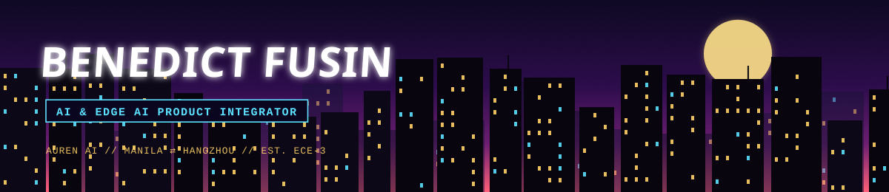

## 🚀&nbsp; About Me

**>_ Full-Stack Developer & Hardware Integrator** - focusing on AI, SaaS, B2C, and embedded systems 
**>_ ECE Student at PUP Sta. Mesa,** turning coursework into shipped prototypes 
**>_ AI & Edge AI Product Integrator at Auren AI** — getting models running on real, constrained hardware 
**>_ Builder of Things:** Prototyping NodeMCU robotics, MATLAB virtual labs, and IoT automated systems 
**>_ Splitting time between Manila, Philippines and Hangzhou, Zhejiang, China** 
**>_ Python & C++** for data, pipelines, ML experimentation, and microcontrollers 
**>_ TypeScript** for the product surfaces the models live behind 
**>_ Outside of engineering, I run an art sideline making portraits and landscapes** 
**>_ Obsessed with the gap between "the model works" and "the product works"** 

## 🧰&nbsp; Tech Stack

 

  

  

  

  

  

  

  

  

  

  

  

  

  

## ⚙️&nbsp; Currently

## 📡&nbsp; Let's Connect

  

> *"Ship it where it actually has to run."*

